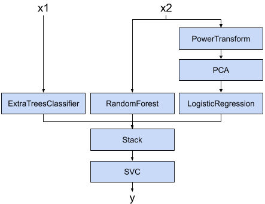
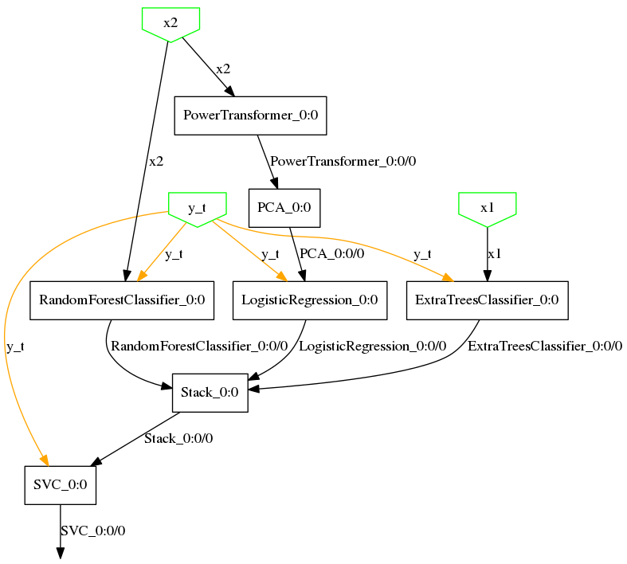

# baikal

[](https://circleci.com/gh/alegonz/baikal/tree/master)
[](https://codecov.io/gh/alegonz/baikal)
[](https://github.com/psf/black)
[](https://pypi.org/project/baikal)
[](https://github.com/alegonz/baikal/blob/master/LICENSE)

A graph-based functional API for building complex scikit-learn pipelines.

**baikal** is written in pure Python. It supports Python 3.5 and above.

Note: **baikal** is still a young project and there might be backward incompatible changes. The next development steps and backwards-incompatible changes are announced and discussed in [this issue](https://github.com/alegonz/baikal/issues/16). Please subscribe to it if you use **baikal**.

##### Documentation
* [dev](https://github.com/alegonz/baikal/blob/master/README.md)
* [0.2.x](https://github.com/alegonz/baikal/blob/release/v0.2.0/README.md)
* [0.1.x](https://github.com/alegonz/baikal/blob/release/v0.1.0/README.md)

Please refer to the [changelog](CHANGELOG.md) for the details on each release.

---
*Contents:*
1. **[Introduction](#introduction)**
2. **[Installation](#installation)**
3. **[Quick-start guide](#quick-start-guide)**
4. **[User guide](#user-guide)**
5. **[Examples](#examples)**
6. **[Next development steps](#next-development-steps)**
7. **[Contributing](#contributing)**
---

## Introduction

### What is baikal?

**baikal is a graph-based, functional API for building complex machine learning pipelines of objects that implement the [scikit-learn API](https://scikit-learn.org/stable/developers/contributing.html#different-objects)**. It is mostly inspired on the excellent [Keras](https://keras.io) API for Deep Learning, and borrows a few concepts from the [TensorFlow](https://www.tensorflow.org) framework and the (perhaps lesser known) [graphkit](https://github.com/yahoo/graphkit) package.

**baikal** aims to provide an API that allows to build complex, non-linear machine learning pipelines that looks like this: 




with code that looks like this:

```python
x1 = Input()
x2 = Input()
y_t = Input()

y1 = ExtraTreesClassifier()(x1, y_t)
y2 = RandomForestClassifier()(x2, y_t)
z = PowerTransformer()(x2)
z = PCA()(z)
y3 = LogisticRegression()(z, y_t)

ensemble_features = Stack()([y1, y2, y3])
y = SVC()(ensemble_features, y_t)

model = Model([x1, x2], y, y_t)
```

### What can I do with it?

With **baikal** you can

- build non-linear pipelines effortlessly
- handle multiple inputs and outputs
- add steps that operate on targets as part of the pipeline
- nest pipelines
- use prediction probabilities (or any other kind of output) as inputs to other steps in the pipeline
- query intermediate outputs, easing debugging
- freeze steps that do not require fitting
- define and add custom steps easily
- plot pipelines

All with boilerplate-free, readable code.

### Why baikal?

The pipeline above (to the best of the author's knowledge) cannot be easily built using [scikit-learn's composite estimators API](https://scikit-learn.org/stable/modules/compose.html#pipelines-and-composite-estimators) as you encounter some limitations:

1. It is aimed at linear pipelines
    - You could add some step parallelism with the [`ColumnTransformer`](https://scikit-learn.org/stable/modules/compose.html#columntransformer-for-heterogeneous-data) API, but this is limited to transformer objects.
2. Classifiers/Regressors can only be used at the end of the pipeline.
    - This means we cannot use the predicted labels (or their probabilities) as features to other classifiers/regressors.
    - You could leverage mlxtend's [`StackingClassifier`](http://rasbt.github.io/mlxtend/user_guide/classifier/StackingClassifier/#stackingclassifier) and come up with some clever combination of the above composite estimators (`Pipeline`s, `ColumnTransformer`s, and `StackingClassifier`s, etc), but you might end up with code that feels hard-to-follow and verbose.
3. Cannot handle multiple input/multiple output models.

Perhaps you could instead define a big, composite estimator class that integrates each of the pipeline steps through composition. This, however, most likely will require 
* writing big `__init__` methods to control each of the internal steps' knobs;
* being careful with `get_params` and `set_params` if you want to use, say, `GridSearchCV`;
* and adding some boilerplate code if you want to access the outputs of intermediate steps for debugging.

By using **baikal** as shown in the example above, code can be more readable, less verbose and closer to our mental representation of the pipeline. **baikal** also provides an API to fit, predict with, and query the entire pipeline with single commands, as we will see below. 

## Key concepts

The baikal API introduces three basic elements:

* **Step**: Steps are the building blocks of the API. Conceptually similar to TensorFlow's operations and Keras layers, each Step is a unit of computation (e.g. PCA, Logistic Regression) that take the data from preceding Steps and produce data to be used by other Steps further in the pipeline. Steps are defined by combining the `Step` mixin class with a base class that implements the scikit-learn API. This is explained in more detail below. 
* **DataPlaceholder**: The inputs and outputs of Steps. If Steps are like TensorFlow operations or Keras layers, then DataPlaceHolders are akin to tensors. Don't be misled though, DataPlaceholders are just minimal, low-weight auxiliary objects whose main purpose is to keep track of the input/output connectivity between steps, and serve as the keys to map the actual input data to their appropriate Step. They are not arrays/tensors, nor contain any shape/type information whatsoever.
* **Model**: A Model is a network (more precisely, a directed acyclic graph) of Steps, and it is defined from the input/output specification of the pipeline. Models have fit and predict routines that, together with graph-based engine, allow the automatic (feed-forward) computation of each of the pipeline steps when fed with data.

## Installation

To install the latest released version from PyPI:

```bash
pip install baikal
```

If you wish to install the latest development version, you can do so with:

```bash
pip install git+https://github.com/alegonz/baikal.git@master#egg=baikal
```

### Requirements

* numpy

## Quick-start guide

Without further ado, here's a short example of a simple SVC model built with **baikal**:

```python
import sklearn.svm
from sklearn.datasets import load_breast_cancer
from sklearn.model_selection import train_test_split

from baikal import make_step, Input, Model


# 1. Define a step
SVC = make_step(sklearn.svm.SVC)

# 2. Build the model
x = Input()
y_t = Input()
y = SVC(C=1.0, kernel="rbf", gamma=0.5)(x, y_t)
model = Model(x, y, y_t)

# 3. Train the model
dataset = load_breast_cancer()
X_train, X_test, y_train, y_test = train_test_split(
    dataset.data, dataset.target, random_state=0
)

model.fit(X_train, y_train)

# 4. Use the model
y_test_pred = model.predict(X_test)
```

## User guide

As shown in the short example above, the **baikal** API consists of four basic steps:

1. Define the steps
2. Build the model
3. Train the model
4. Use the model

Let's take a look at each of them in detail. Full examples can be found in the project's [examples](examples) folder.

### 1. Define the steps

A step is defined very easily, just feed the provided `make_step` function with the class you want to make a step from:

```python
import sklearn.linear_model
from baikal import make_step

LogisticRegression = make_step(sklearn.linear_model.LogisticRegression)
```

You can make a step from any class you like, so long that class implements the [scikit-learn API](https://scikit-learn.org/stable/developers/contributing.html#different-objects).

What this function is doing under the hood, is to combine the given class with the `Step` mixin class. The `Step` mixin, among other things, endows the given class with a `__call__` method, making the class callable on the outputs (`DataPlaceholder` objects) of previous steps. If you prefer to do this manually, you only have to:

1. Define a class that inherits from both the `Step` mixin and the class you wish to make a step of (in that order!).
2. In the class `__init__`, call `super().__init__(...)` and pass the appropriate step parameters.

For example, to make a step for `sklearn.linear_model.LogisticRegression` we do:

```python
import sklearn.linear_model
from baikal import Step

# The order of inheritance is important!
class LogisticRegression(Step, sklearn.linear_model.LogisticRegression):
    def __init__(self, name=None, n_outputs=1, **kwargs):
        super().__init__(name=name,n_outputs=n_outputs,**kwargs)
```

Other steps are defined similarly (omitted here for brevity).

**baikal** can also handle steps with multiple input/outputs/targets. The base class may implement a predict/transform method (the compute function) that take multiple inputs and returns multiple outputs, and a fit method that takes multiple inputs and targets (native scikit-learn classes at present take one input, return one output, and take at most one target). In this case, the input/target arguments are expected to be a list of (typically) array-like objects, and the compute function is expected to return a list of array-like objects. For example, the base class may implement the methods like this:

```python
class SomeClass(BaseEstimator):
    ...
    def predict(self, Xs):
        X1, X2 = Xs
        # use X1, X2 to calculate y1, y2
        return y1, y2

    def fit(self, Xs, ys):
        (X1, X2), (y1, y2) = Xs, ys
        # use X1, X2, y1, y2 to fit the model
        return self
```

### 2. Build the model

Once we have defined the steps, we can make a model like shown below. First, you create the initial step, that serves as the entry-point to the model, by calling the `Input` helper function. This outputs a DataPlaceholder representing one of the inputs to the model. Then, all you have to do is to instantiate the steps and call them on the outputs (DataPlaceholders from previous steps) as you deem appropriate. Finally, you instantiate the model with the inputs/outputs (also DataPlaceholders) that specify your pipeline.

This style should feel familiar to users of Keras.

Note that steps that require target data (like `ExtraTreesClassifier`, `RandomForestClassifier`, `LogisticRegression` and `SVC`) are called with two arguments. These arguments correspond to the inputs (e.g. `x1`, `x2`) and targets (e.g. `y_t`) of the step. These targets are specified to the Model at instantiation via the third argument. **baikal** pipelines are made of complex, heterogenous, non-differentiable steps (e.g. a whole RandomForestClassifier, with its own internal learning algorithm), so there's no some magic automatic differentiation that backpropagates the target information from the outputs to the appropriate steps, so we must specify which step needs which targets directly.

```python
from baikal import Input, Model
from baikal.steps import Stack

# Assume the steps below were already defined
x1 = Input()
x2 = Input()
y_t = Input()

y1 = ExtraTreesClassifier()(x1, y_t)
y2 = RandomForestClassifier()(x2, y_t)
z = PowerTransformer()(x2)
z = PCA()(z)
y3 = LogisticRegression()(z, y_t)

ensemble_features = Stack()([y1, y2, y3])
y = SVC()(ensemble_features, y_t)

model = Model([x1, x2], y, y_t)
```

You can call the same step on different inputs and targets to reuse the step (similar to the concept of shared layers and nodes in Keras), and specify a different `compute_func`/`trainable` configuration on each call. This is achieved via "ports": each call creates a new port and associates the given configuration to it. You may access the configuration at each port using the `get_*_at(port)` methods.

(*) Steps are called on and output DataPlaceholders. DataPlaceholders are produced and consumed exclusively by Steps, so you do not need to instantiate these yourself.

### 3. Train the model

Now that we have built a model, we are ready to train it. The model also follows the scikit-learn API, as it has a fit method:

```python
model.fit(X=[X1_train, X2_train], y=y_train)
```

The model will automatically propagate the data through the pipeline and fit any internal steps that require training.

The fit function takes three arguments:
- `X`: Input data (independent variables).
    - It can be either of the following:
        - A single array-like object (in the case of a single input)
        - A list of array-like objects (in the case of multiple inputs)
        - A dictionary mapping DataPlaceholders (or their names) to array-like objects. The keys must be among the inputs passed at instantiation.
- `y` (optional): Target data (dependent variables).
    - It can either of the following:
        - None (in the case all steps are either non-trainable and/or unsupervised learning steps)
        - A single array-like object (in the case of a single target)
        - A list of array-like objects (in the case of multiple targets)
        - A dictionary mapping DataPlaceholders (or their names) to array-like objects. The keys must be among the targets passed at instantiation.

### 4. Use the model

To predict with model, just pass the input data like you would for the fit method. The model will automatically propagate the inputs through all the steps and produce the outputs specified at instantiation.

```python
y_test_pred = model.predict([X1_test, X2_test])

# This also works:
y_test_pred = model.predict({x1: X1_test, x2: X2_test})
```

**Models are query-able**. That is, you can request other outputs other than those specified at model instantiation. This allows querying intermediate outputs and ease debugging. For example, to get both the output from PCA and the ExtraTreesClassifier:

```python
outs = model.predict(
    [X1_test, X2_test], output_names=["ExtraTreesClassifier_0/0", "PCA_0/0"]
)
```

You don't need to pass inputs that are not required to compute the queried output. For example, if we just want the output of `PowerTransformer`: 

```python
outs = model.predict({x2: X2_data}, output_names="PowerTransformer_0/0")
```

**Models are also nestable**. In fact, Models are steps, too. This allows composing smaller models into bigger ones, like so:

```python
# Assume we have two previously built complex
# classifier models, perhaps loaded from a file.
submodel1 = ...
submodel2 = ...

# Now we make an stacked classifier from both submodels
x = Input()
y_t = Input()
y1 = submodel1(x)
y2 = submodel2(x, y_t)
z = Stack()([y1, y2])
y = SVC()(z, y_t)
bigmodel = Model(x, y, y_t)

```

### Persisting the model

Like sklearn objects, models can be serialized with pickle or joblib without any extra setup:

```python
import joblib
joblib.dump(model, "model.pkl")
model_reloaded = joblib.load("model.pkl")
```

Keep in mind, however, the [security and maintainability limitations](https://scikit-learn.org/stable/modules/model_persistence.html#security-maintainability-limitations) of these formats.

[//]: # (TODO: Add here a brief explanation of what we mean by scikit-learn API)

### Utilities

#### sklearn wrapper for `GridSearchCV`

Currently, **baikal** also provides a wrapper utility class that allows models to used in scikit-learn's [`GridSearchCV` API](https://scikit-learn.org/stable/modules/generated/sklearn.model_selection.GridSearchCV.html#sklearn-model-selection-gridsearchcv). Below there's a code snippet showing its usage. It follows the style of Keras' own wrapper. [Here](examples/gridsearchcv_sklearn_wrapper.py) is an example script of this utility.

A future release of **baikal** plans to include a custom `GridSearchCV` API, based on the original scikit-learn implementation, that can handle baikal models natively, avoiding a couple of gotchas with the current wrapper implementation (mentioned below).

```python
# 1. Define a function that returns your baikal model
def build_fn():
    x = Input()
    y_t = Input()
    h = PCA(random_state=random_state, name="pca")(x)
    y = LogisticRegression(random_state=random_state, name="classifier")(h, y_t)
    model = Model(x, y, y_t)
    return model

# 2. Define a parameter grid
# - keys have the [step-name]__[parameter-name] format, similar to sklearn Pipelines
# - You can also search over the steps themselves using [step-name] keys
param_grid = [
    {
        "classifier": [LogisticRegression()],
        "classifier__C": [0.01, 0.1, 1],
        "pca__n_components": [1, 2, 3, 4],
    },
    {
        "classifier": [RandomForestClassifier()],
        "classifier__n_estimators": [10, 50, 100],
    },
]

# 3. Instantiate the wrapper
sk_model = SKLearnWrapper(build_fn)

# 4. Use GridSearchCV as usual
gscv_baikal = GridSearchCV(sk_model, param_grid)
gscv_baikal.fit(x_data, y_data)
best_model = gscv_baikal.best_estimator_.model
```

Currently there are a couple of gotchas:

* The `cv` argument of `GridSearchCV` will default to KFold if the estimator is a baikal Model, so you have to specify an appropriate splitter directly if you need another splitting scheme.
* `GridSearchCV` cannot handle models with multiple inputs/outputs. A way to work around this is to split the input data and merge the outputs within the model.

#### Plotting your model

The baikal package includes a plot utility:

```python
from baikal.plot import plot_model
plot_model(model, filename="model.png")
```

For the example above, it produces this:



In order to use the plot utility, you need to install [pydot](https://pypi.org/project/pydot) and [graphviz](https://graphviz.gitlab.io).

## Examples

### Stacked classifiers (naive protocol)

Similar to the the example in the quick-start above, (a naive) stacks of classifiers (or regressors) can be built like shown below. Note that you can specify the function the step should use for computation, in this case `compute_func='predict_proba'` to use the label probabilities as the features of the meta-classifier.

```python
x = Input()
y_t = Input()
y_p1 = LogisticRegression()(x, y_t, compute_func="predict_proba")
y_p2 = RandomForestClassifier()(x, y_t, compute_func="predict_proba")
# predict_proba returns arrays whose columns sum to one, so we drop one column
y_p1 = Lambda(lambda array: array[:, 1:])(y_p1)
y_p2 = Lambda(lambda array: array[:, 1:])(y_p2)
ensemble_features = ColumnStack()([y_p1, y_p2])
y_p = ExtraTreesClassifier()(ensemble_features, y_t)

model = Model(x, y_p, y_t)
```

Click [here](examples/stacked_classifiers_naive.py) for a full example.

### Stacked classifiers (standard protocol)

In the naive stack above, each classifier in the 1st level will calculate the predictions for the 2nd level using the same data it used for fitting its parameters. This is prone to overfitting as the 2nd level classifier will tend to give more weight to an overfit classifier in the 1st level. To avoid this, the standard protocol recommends that, during fit, the 1st level classifiers are still trained on the original data, but instead they provide out-of-fold (OOF) predictions to the 2nd level classifier. To achieve this special behavior, we leverage the `fit_compute_func` API: we define a `fit_predict` method that does the fitting and the OOF predictions, and add it as a method of the 1st level classifiers (`LogisticRegression` and `RandomForestClassifier`, in the example below) when making the steps. **baikal** will then detect and use this method during fit.

```python
from sklearn.model_selection import cross_val_predict


def fit_predict(self, X, y):
    self.fit(X, y)
    return cross_val_predict(self, X, y, method="predict_proba")


attr_dict = {"fit_predict": fit_predict}

# 1st level classifiers
LogisticRegression = make_step(sklearn.linear_model.LogisticRegression, attr_dict)
RandomForestClassifier = make_step(sklearn.ensemble.RandomForestClassifier, attr_dict)

# 2nd level classifier
ExtraTreesClassifier = make_step(sklearn.ensemble.ExtraTreesClassifier)

# The rest of the stack is build exactly the same as in the naive example.
```

Click [here](examples/stacked_classifiers_standard.py) for a full example.

### Classifier chain

The API also lends itself for more interesting configurations, such as that of [classifier chains](https://en.wikipedia.org/wiki/Classifier_chains). By leveraging the API and Python's own control flow, a classifier chain model can be built as follows:

```python
x = Input()
y_t = Input()
order = list(range(n_targets))
random.shuffle(order)

ys_t = Split(n_targets, axis=1)(y_t)
ys_p = []
for j, k in enumerate(order):
    x_stacked = ColumnStack()([x, *ys_p[:j]])
    ys_t[k] = Lambda(np.squeeze, axis=1)(ys_t[k])
    ys_p.append(LogisticRegression()(x_stacked, ys_t[k]))

ys_p = [ys_p[order.index(j)] for j in range(n_targets)]
y_p = ColumnStack()(ys_p)

model = Model(x, y_p, y_t)
```

Click [here](examples/classifier_chain.py) for a full example.

Sure, scikit-learn already does have [`ClassifierChain`](https://scikit-learn.org/stable/modules/generated/sklearn.multioutput.ClassifierChain.html#sklearn.multioutput.ClassifierChain) and [`RegressorChain`](https://scikit-learn.org/stable/modules/generated/sklearn.multioutput.RegressorChain.html#sklearn.multioutput.RegressorChain) classes for this. But with **baikal** you could, for example, mix classifiers and regressors to predict multilabels that include both categorical and continuous labels.

### Transformed target

You can also call steps on the targets to apply transformations on them. Note that by making the transformed a shared step, you can re-use learned parameters to apply the inverse transform later in the pipeline.

```python
transformer = QuantileTransformer(n_quantiles=300, output_distribution="normal")

x = Input()
y_t = Input()
# QuantileTransformer requires an explicit feature dimension, hence the Lambda step
y_t_trans = Lambda(np.reshape, newshape=(-1, 1))(y_t)
y_t_trans = transformer(y_t_trans)
y_p_trans = RidgeCV()(x, y_t_trans)
y_p = transformer(y_p_trans, compute_func="inverse_transform", trainable=False)
# Note that transformer is a shared step since it was called twice

model = Model(x, y_p, y_t)
```

Click [here](examples/transformed_target.py) for a full example.

## Contributing

- Bug reports and fixes are always welcome!
- Contributions to extend/refactor/improve/document the API are also welcome! **baikal** is currently a one-man operation, and it could benefit from more minds and hands working on it :)

### Setting up the development environment
1. Clone the project.
2. From the project root folder run: `make setup_dev`.
    - This will create a virtualenv and install the package in development mode.
    - It will also install a pre-commit hook for the black code formatter.
    - You need Python 3.5 or above.
3. To run the tests use: `make test`, or `make test-cov` to include coverage.
    - The tests include a test for the plot utility, so you need to install graphviz.
